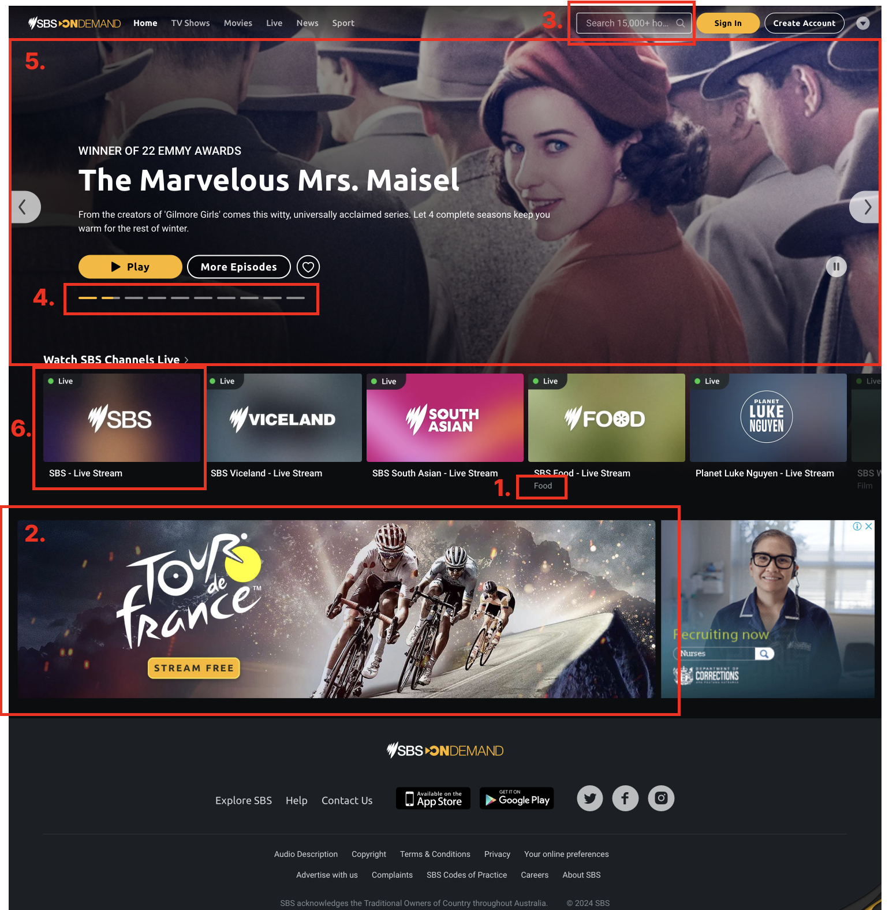

# group2-pwcc-a3

This is group 2's Accessibility redesign of the [SBS.com.au/ondemand/](https://www.sbs.com.au/ondemand/) homepage following the results of our accessibility audit using the WCAG 2.2 level A.

The final prototype is deployed to: [Railway](https://group2-pwcc-a3-production.up.railway.app)

## WCAG 2.2 A Results & Suggestions for the chosen homepage

1. **Percievable Text:** (Genre Labels)Font size for genre label is too small (should be at least 16px)
2. **ARIA attribute is not allowed:** (Content banner) Aria label is not allowed on generic role, should be aria-labelledby
3. **Missing required ARIA attribute:** (Search bar autocomplete drop down) Autocomplete is missing aria-controls
4. **No label for button element:** (Carousel) Carousel buttons should have aria-label, should be aria-hidden
5. **Values assigned to role="" are not valid ARIA roles:** (Carousel background image) Images should not be given role="presentation" to hide the decorative image
6. **Keyboard execution on content buttons:** (Main content) User can navigate between content, but cannot execute the content buttons using ENTER or SPACE

## Prototype planning 

- The areas of particular interest are shown below with the corresponding feedback
  

## About the app

This project was bootstrapped with [Create React App](https://github.com/facebook/create-react-app).

In the project directory, you can run:

### `npm start`

Runs the app in the development mode.\
Open [http://localhost:3000](http://localhost:3000) to view it in your browser.

The page will reload when you make changes.\
You may also see any lint errors in the console.
